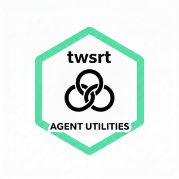

<p align="center">
  
</p>


Agent security configuration generator — translates canonical security rules into agent-specific configs.

## The Problem

AI coding agents (Claude Code, Copilot CLI, etc.) each have their own permission model and
configuration format. Maintaining security rules independently per agent leads to configuration
drift, and coverage gaps.

Meanwhile, Anthropic's [Sandbox Runtime Tool
(SRT)](https://github.com/anthropic-experimental/sandbox-runtime) enforces OS-level restrictions
(filesystem deny, network allowlists) for Bash commands via kernel sandboxing. But SRT cannot
control an agent's built-in tools (Read, Write, Edit, WebFetch) — those run inside the agent's own
process.

## The Solution: Defense in Depth

`twsrt` tries to bridge the gap. It reads the same SRT policy that enforces OS-level Bash
restrictions and translates it into application-level rules for every agent's built-in tools:

```
                CANONICAL SOURCES (human-maintained)
                ====================================
                ~/.srt-settings.json        — OS-level sandbox rules
                ~/.config/twsrt/bash-rules.json — command deny/ask rules
                          |
                          v
                +-----------------+
                |      twsrt      |  deterministic translation
                |   (generator)   |  + drift detection
                +--------+--------+
                         |
            +------------+------------+
            v            v            v
     Claude Code    Copilot CLI    (future agents)
     settings.json  --flag args

                ENFORCEMENT LAYERS
                ==================
     Layer 1 (OS):  SRT sandbox — kernel-level deny (Bash only)
     Layer 2 (App): Agent permissions — tool-level deny/ask (all tools)
```

This gives you **two layers** for the most dangerous attack vector (Bash commands accessing
credentials or network) and **one consistent layer** for built-in tools — all generated from a
single source of truth.

| Access Path | SRT (Layer 1) | Agent Permissions (Layer 2) | Depth |
|---|---|---|---|
| `Bash(cat ~/.aws/credentials)` | Kernel-enforced deny | Tool-level deny | Two layers |
| `Read(~/.aws/credentials)` | Not covered | Tool-level deny | One layer |
| `Bash(curl evil.com)` | Network proxy blocks | Tool-level deny | Two layers |
| `WebFetch(evil.com)` | Not covered | Tool-level allow check | One layer |


You then start your agent either with SRT builtin (e.g. claude-code, pi-mono via extenstion) or with `srt` as
wrapper, e.g. copilot-cli.

```bash
srt -c "copilot \
    --allow-tool 'shell(*)' \
    --allow-tool 'read' \
    --allow-tool 'edit' \
    --allow-tool 'write' \
    --deny-tool 'shell(rm)' \
    --deny-tool 'shell(rmdir)' \
    --deny-tool 'shell(dd)' \
    --deny-tool 'shell(mkfs)' \
    ...
```

For the full security analysis and threat model see [SECURITY_CONCEPT.md](SECURITY_CONCEPT.md).

## Overview

`twsrt` reads two canonical sources:

- **SRT settings** (`~/.srt-settings.json`) — filesystem read/write deny rules, write allow rules, network domain allowlists
- **Bash rules** (`~/.config/twsrt/bash-rules.json`) — command deny/ask rules for Bash execution

It generates security configurations for:

- **Claude Code** (`~/.claude/settings.json`) — permissions.deny, permissions.ask, permissions.allow, sandbox.network
- **Copilot CLI** — `--allow-tool` and `--deny-tool` flag snippets

**Key invariant**: Source files are never written by twsrt. Target managed sections are never hand-edited.

## Installation

```bash
# Install as editable uv tool
make install

# Or via pip
pip install twsrt
```

## Usage

### Initialize config directory

```bash
twsrt init                    # Creates ~/.config/twsrt/ with config.toml + bash-rules.json
twsrt init --force            # Overwrite existing files
```

### Generate agent configs

```bash
twsrt generate claude         # Print Claude Code permissions to stdout
twsrt generate copilot        # Print Copilot CLI flags to stdout
twsrt generate                # Generate for all agents

twsrt generate claude --write # Write to ~/.claude/settings.json (selective merge)
twsrt generate claude -n -w   # Dry run: show what would be written
```

### Edit canonical sources

```bash
twsrt edit srt                # Open ~/.srt-settings.json in $EDITOR
twsrt edit bash               # Open ~/.config/twsrt/bash-rules.json in $EDITOR
twsrt edit                    # Show available sources
```

### Detect configuration drift

```bash
twsrt diff claude             # Compare generated vs existing settings.json
twsrt diff                    # Check all agents
```

Exit codes: `0` = no drift, `1` = drift detected, `2` = missing file.

### Typical workflow

```bash
twsrt edit srt                # Add a domain to allowedDomains
twsrt generate claude         # Preview the change
twsrt generate claude --write # Apply (selective merge preserves hooks, MCP, etc.)
twsrt diff claude             # Verify: exit 0 = no drift
```

## Configuration

[SRT](https://github.com/anthropic-experimental/sandbox-runtime) is a dependency and needs to be
installed separately.

### `~/.srt-settings.json` (SRT — prerequisite)

SRT configuration is the primary
canonical source that defines OS-level enforcement boundaries. **twsrt** reads it to
generate matching agent-level rules:

```json
{
  "filesystem": {
    "denyRead":  ["~/.aws", "~/.ssh", "~/.gnupg", "~/.netrc"],
    "denyWrite": ["**/.env", "**/*.pem", "**/*.key", "**/secrets/**"],
    "allowWrite": [".", "/tmp", "~/dev"]
  },
  "network": {
    "allowedDomains": [
      "github.com", "*.github.com",
      "pypi.org", "*.pypi.org",
      "registry.npmjs.org"
    ]
  }
}
```

Comprehensive example: 
[.srt-settings.json](example/.srt-settings.json)


### `~/.config/twsrt/config.toml`

```toml
[sources]
srt = "~/.srt-settings.json"
bash_rules = "~/.config/twsrt/bash-rules.json"

[targets]
claude_settings = "~/.claude/settings.json"
# copilot_output = "~/.config/twsrt/copilot-flags.txt"  # optional, stdout if omitted
```

### `~/.config/twsrt/bash-rules.json`

```json
{
  "deny": ["rm", "sudo", "git push --force"],
  "ask": ["git push", "git commit", "pip install"]
}
```
Comprehensive example:
[bash-rules.json](example/bash-rules.json)

## Rule Mapping

| SRT / Bash Rule | Claude Code | Copilot CLI |
|-----------------|-------------|-------------|
| denyRead directory | Tool(path) + Tool(path/**) in deny | (SRT enforces) |
| denyRead file | Tool(path) in deny | (SRT enforces) |
| denyWrite pattern | Write/Edit/MultiEdit in deny | (SRT enforces) |
| allowWrite path | (no output) | --allow-tool flags |
| allowedDomains domain | WebFetch(domain:X) in allow + sandbox.network | (SRT enforces) |
| Bash deny cmd | Bash(cmd) + Bash(cmd *) in deny | --deny-tool 'shell(cmd)' |
| Bash ask cmd | Bash(cmd) + Bash(cmd *) in ask | --deny-tool (lossy, warns) |

Where Tool = Read, Write, Edit, MultiEdit. Directory vs file detection uses the
filesystem at generation time; glob patterns and unknown paths are treated as
bare patterns (no `/**` suffix for globs, `/**` added for unknown paths).

## Development

```bash
make test              # Run tests
make lint              # Ruff lint
make format            # Ruff format
make ty                # Type check with ty
make static-analysis   # All of the above
```
