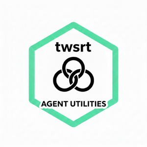

<p align="center">
  
</p>


Agent security configuration generator — translates canonical security rules into agent-specific configs.

## The Problem

### Insufficient

AI coding agents (Claude Code, Copilot CLI, etc.) each have their own permission model and
configuration format. Maintaining security rules independently per agent leads to configuration
drift, and coverage gaps.

### Better
Anthropic's [Sandbox Runtime Tool
(SRT)](https://github.com/anthropic-experimental/sandbox-runtime) enforces OS-level restrictions
 for Bash commands via kernel sandboxing. But SRT cannot
control an agent's built-in tools (Read, Write, Edit, WebFetch) — those run inside the agent's own
process.

## Solution: Defense in Depth (Use Both)

`twsrt` bridges the gap. It reads the **same SRT policy** that enforces OS-level Bash
restrictions and translates it into application-level rules for the agent's built-in tools:

```
                CANONICAL SOURCES (human-maintained)
                ====================================
                ~/.srt-settings.json        — OS-level sandbox rules (SRT)
                ~/.config/twsrt/bash-rules.json — APP-level deny/ask rules
                          |
                          v
                +-----------------+
                |      twsrt      |  deterministic translation
                |   (generator)   |  + drift detection
                +--------+--------+
                         |
            +------------+------------+
            v            v            v
     Claude Code    Copilot CLI    (tbd future agents)
     settings.json  --flag args

                ENFORCEMENT LAYERS
                ==================
     Layer 1 (OS):  SRT sandbox — kernel-level deny (Bash only)
     Layer 2 (App): Agent permissions — agent-level deny/ask (all tools)
```

This gives two layers of protection for the most dangerous attack vector (Bash commands accessing
credentials or network) and one layer for built-in tools — **generated from a single source of truth**.

Example for collaboration of the two layers:


| Access Path | SRT (Layer 1) | Agent Permissions (Layer 2) | Depth |
|---|---|---|---|
| `Bash(cat ~/.aws/credentials)` | Kernel-enforced deny | Tool-level deny | Two layers |
| `Read(~/.aws/credentials)` | Not covered | Tool-level deny | One layer |
| `Bash(curl evil.com)` | Network proxy blocks | Tool-level deny | Two layers |
| `WebFetch(evil.com)` | Not covered | Tool-level allow check | One layer |


For the full security analysis and threat model see [SECURITY_CONCEPT.md](SECURITY_CONCEPT.md).

For pi-mono solution see [twsrt](https://github.com/sysid/pi-extensions/tree/main/packages/sandbox).

## Overview

`twsrt` reads canonical rule configuration sources:

1. **SRT settings** (`~/.srt-settings.json`) — OS-level enforced sandbox rules
2. **Bash rules** (`~/.config/twsrt/bash-rules.json`) — APP-level enforced deny/ask rules for Bash tool execution

It generates security configurations for:

- **Claude Code** (`~/.claude/settings.json` — permissions + sandbox configuration
- **Copilot CLI** — `--allow-tool` and `--deny-tool` code snippets for used in calling
  copilot

**Key invariant**: Canonical source files, edited by user. 


### Usage

```bash
pip install twsrt

#### Initialize config directory
twsrt init                    # Creates ~/.config/twsrt/ with config.toml + bash-rules.json
twsrt init --force            # Overwrite existing files

#### Generate agent configs
twsrt generate claude         # Print Claude Code permissions to stdout
twsrt generate copilot        # Print Copilot CLI flags to stdout
twsrt generate                # Generate for all agents

twsrt generate claude --write # Write to settings.full.json, symlink settings.json → it
twsrt generate claude -n -w   # Dry run: show what would be written

#### Edit canonical sources
twsrt edit srt                # Open ~/.srt-settings.json in $EDITOR
twsrt edit bash               # Open ~/.config/twsrt/bash-rules.json in $EDITOR
twsrt edit                    # Show available sources

#### Detect configuration drift
twsrt diff claude             # Compare generated vs existing target file
twsrt diff                    # Check all agents
twsrt diff --yolo             # Compare against yolo-specific config files
```

Exit codes: `0` = no drift, `1` = drift detected, `2` = missing file.

`diff` compares a **freshly generated config** (from your current SRT + bash rule sources)
against the **existing agent config file on disk**:

```
  Canonical sources                          Agent config on disk
  (SRT rules + bash rules)                   (e.g. settings.full.json)
          |                                           |
          v                                           v
    [ generate in memory ]  ──── compare ────  [ read from disk ]
          |                                           |
          +--- missing: in generated but not on disk (rules not yet applied)
          +--- extra:   on disk but not in generated  (out-of-band edits)
```

This detects two kinds of drift: unapplied rule changes (you edited SRT/bash rules
but forgot to `generate --write`) and out-of-band modifications (someone edited the
agent config directly).

#### Typical workflow

```bash
twsrt edit srt                # Add a domain to allowedDomains
twsrt generate claude         # Preview the change
twsrt generate claude --write # Apply (selective merge preserves hooks, MCP, etc.)
twsrt diff claude             # Verify: exit 0 = no drift
```


## Copilot Configuration (`generate copilot -w`)

Copilot has no settings file — it uses CLI flags. `twsrt generate copilot` produces a
line-continuation code snippet you paste into your launch command:

```
--allow-tool 'shell(*)' \
--allow-tool 'read' \
--allow-tool 'edit' \
--allow-tool 'write' \
--deny-tool 'shell(rm)' \
--deny-tool 'shell(sudo)' \
--allow-url 'github.com' \
--allow-url '*.github.com' \
```

**Lossy mappings**: Copilot has no `ask` equivalent. So ask rules are conservatively mapped to
`--deny-tool`. 

`allowWrite` rules emit `--allow-tool` flags
(shell, read, edit, write). Network deny rules emit `--deny-url`.

**YOLO mode** (`generate --yolo copilot`): Outputs `--yolo` as first flag, followed
by `--deny-tool` and `--deny-url` only. 

ONLY USE THIS TOGETHER WITH SRT !!

Deny rules take precedence over `--yolo`:

```
--yolo \
--deny-tool 'shell(rm)' \
--deny-tool 'shell(sudo)' \
--deny-url 'evil.com' \
```

Run copilot with sandbox `srt` as wrapper:

```bash
srt -c "copilot \
    --allow-tool 'shell(*)' \
    --allow-tool 'read' \
    --allow-tool 'edit' \
    --allow-tool 'write' \
    --deny-tool 'shell(rm)' \
    --deny-tool 'shell(rmdir)' \
    --deny-tool 'shell(dd)' \
    --deny-tool 'shell(mkfs)' \
    ...
```

## Claude Configuration (`generate claude -w`)

**Target file**: `~/.claude/settings.full|yolo.json` (configured via `claude_settings` in config.toml)

**Symlink**: `~/.claude/settings.json` → `settings.full|yolo.json` (created/updated automatically)

With `-w`, twsrt writes to `settings.full|yolo.json` and creates a symlink from
`settings.json` to the target. 

If `settings.json` is a regular file (e.g. first run), it is moved to `settings.full|yolo.json`
automatically.

You run your agent either with SRT builtin (e.g. claude-code) or via an extensions, e.g. pi-mono.

**Selective merge**: `twsrt` updates only specific sections and preserves everything else:
- hooks, additionalDirectories, MCP allows, blanket tool allows, etc. are untouched

### Merge strategy per section

| Section | Strategy | Detail |
|---|---|---|
| `permissions.deny` | **Fully replaced** | |
| `permissions.ask` | **Fully replaced** | |
| `permissions.allow` | **Selective** | Only `WebFetch(domain:...)` entries replaced; existing allows preserved |
| `sandbox.network` | **Key-by-key merge** | unmanaged keys preserved |
| `sandbox.filesystem` | **Key-by-key merge** | unmanaged keys preserved |
| `sandbox.*` (top-level) | **Key-by-key merge** | `enabled`, `enableWeaker*`, `ignoreViolations` overwrite; Claude-only keys preserved |
| `hooks` | **Preserved** | Untouched |
| `additionalDirectories` | **Preserved** | Untouched |
| All other keys | **Preserved** | Untouched |

### Example: before and after `generate claude -w`

**Existing `~/.claude/settings.full.json`** (hand-maintained):

```json
{
  "permissions": {
    "deny": [
      "Bash(old-deny-entry)"
    ],
    "ask": [
      "Bash(old-ask-entry)"
    ],
    "allow": [
      "Read",
      "Glob",
      "Grep",
      "WebSearch",
      "Bash(npm test:*)",
      "mcp__memory__store",
      "WebFetch(domain:old.example.com)"
    ]
  },
  "hooks": {
    "PreToolUse": [
      { "matcher": "Bash", "hooks": [{ "type": "command", "command": "my-hook" }] }
    ]
  },
  "additionalDirectories": ["/home/user/other-project"],
  "sandbox": {
    "network": {
      "allowedDomains": ["old.example.com"],
      "allowLocalBinding": true
    },
    "autoAllowBashIfSandboxed": true,
    "excludedCommands": ["docker"]
  }
}
```

**After `twsrt generate claude -w`** (with SRT rules for `github.com`, `*.github.com`,
bash deny `rm`/`sudo`, bash ask `git push`, denyRead `~/.aws`):

```json
{
  "permissions": {
    "deny": [
      "Read(~/.aws)",
      "Read(~/.aws/**)",
      "Write(~/.aws)",
      "Write(~/.aws/**)",
      "Edit(~/.aws)",
      "Edit(~/.aws/**)",
      "MultiEdit(~/.aws)",
      "MultiEdit(~/.aws/**)",
      "Bash(rm)",
      "Bash(rm *)",
      "Bash(sudo)",
      "Bash(sudo *)"
    ],
    "ask": [
      "Bash(git push)",
      "Bash(git push *)"
    ],
    "allow": [
      "Read",
      "Glob",
      "Grep",
      "WebSearch",
      "Bash(npm test:*)",
      "mcp__memory__store",
      "WebFetch(domain:github.com)",
      "WebFetch(domain:*.github.com)"
    ]
  },
  "hooks": {
    "PreToolUse": [
      { "matcher": "Bash", "hooks": [{ "type": "command", "command": "my-hook" }] }
    ]
  },
  "additionalDirectories": ["/home/user/other-project"],
  "sandbox": {
    "network": {
      "allowedDomains": ["github.com", "*.github.com"],
      "allowLocalBinding": true
    },
    "autoAllowBashIfSandboxed": true,
    "excludedCommands": ["docker"]
  }
}
```

**YOLO mode** (`generate --yolo claude -w`): Same selective merge, but the `permissions.ask`
section is removed.

Target defaults to `settings.yolo.json`.

Deny rules still apply — Claude's `--dangerously-skip-permissions` does not override deny entries.

**What changed** (twsrt-managed) vs **what didn't** (user-managed):

```
  permissions.deny          ← REPLACED (old-deny-entry gone, new rules from SRT + bash-rules)
  permissions.ask           ← REPLACED (old-ask-entry gone, new rules from bash-rules)
  permissions.allow
    ├─ Read, Glob, ...      ← PRESERVED (not WebFetch entries)
    ├─ Bash(npm test:*)     ← PRESERVED (not WebFetch entries)
    ├─ mcp__memory__store   ← PRESERVED (not WebFetch entries)
    └─ WebFetch(domain:...) ← REPLACED (old.example.com gone, github.com added)
  hooks                     ← PRESERVED (untouched)
  additionalDirectories     ← PRESERVED (untouched)
  sandbox.network
    ├─ allowedDomains       ← REPLACED (managed by twsrt)
    └─ allowLocalBinding    ← PRESERVED (was already there, merge keeps it)
  sandbox.autoAllowBash...  ← PRESERVED (Claude-only key, invisible to twsrt)
  sandbox.excludedCommands  ← PRESERVED (Claude-only key, invisible to twsrt)
```

## Configuration

[SRT](https://github.com/anthropic-experimental/sandbox-runtime) is a dependency and needs to be
installed separately.

> GOTCHA: [sandbox write allowlist is hardcoded and currently cannot be managed in claude-code](https://github.com/anthropics/claude-code/issues/10377#issuecomment-3468689124)

### `~/.srt-settings.json` (SRT — prerequisite)

[SRT configuration](https://github.com/anthropic-experimental/sandbox-runtime?tab=readme-ov-file#configuration) is the canonical source that defines OS-level enforcement boundaries. 

**twsrt** reads it to generate equivalent agent-level rules:

```json
{
  "filesystem": {
    "denyRead":  ["~/.aws", "~/.ssh", "~/.gnupg", "~/.netrc"],
    "denyWrite": ["**/.env", "**/*.pem", "**/*.key", "**/secrets/**"],
    "allowWrite": [".", "/tmp", "~/dev"]
  },
  "network": {
    "allowedDomains": [
      "github.com", "*.github.com",
      "pypi.org", "*.pypi.org",
      "registry.npmjs.org"
    ]
  }
}
```

Comprehensive example: 
[.srt-settings.json](example/.srt-settings.json)


### `~/.config/twsrt/config.toml`

Minimal config (generated by `twsrt init`):

```toml
[sources]
srt = "~/.srt-settings.json"
bash_rules = "~/.config/twsrt/bash-rules.json"

[targets]
claude_settings = "~/.claude/settings.full.json"
```

Full config with all optional keys:

```toml
[sources]
srt = "~/.srt-settings.json"
bash_rules = "~/.config/twsrt/bash-rules.json"

[targets]
claude_settings = "~/.claude/settings.full.json"
copilot_output = "~/.config/twsrt/copilot-flags.txt"    # optional, stdout if omitted

# YOLO target overrides (optional — defaults to inserting .yolo before extension)
# claude_settings_yolo = "~/.claude/settings.yolo.json"
# copilot_output_yolo = "~/.config/twsrt/copilot-flags.yolo.txt"
```

### `~/.config/twsrt/bash-rules.json`

```json
{
  "deny": ["rm", "sudo", "git push --force"],
  "ask": ["git push", "git commit", "pip install"]
}
```
Comprehensive example:
[bash-rules.json](example/bash-rules.json)


## Rule and Security Mappings
### Rule Mapping

| SRT / Bash Rule | Claude Code | Copilot CLI |
|-----------------|-------------|-------------|
| denyRead directory | Tool(path) + Tool(path/**) in deny | (SRT enforces) |
| denyRead file | Tool(path) in deny | (SRT enforces) |
| denyWrite pattern | Write/Edit/MultiEdit in deny | (SRT enforces) |
| allowWrite path | (no output) | --allow-tool flags |
| allowedDomains domain | WebFetch(domain:X) in allow + sandbox.network | (SRT enforces) |
| deniedDomains domain | WebFetch(domain:X) in deny | --deny-url |
| Bash deny cmd | Bash(cmd) + Bash(cmd *) in deny | --deny-tool 'shell(cmd)' |
| Bash ask cmd | Bash(cmd) + Bash(cmd *) in ask | --deny-tool (lossy, warns) |

**YOLO mode differences**: Bash ask rules are skipped entirely. Copilot `--allow-*`
flags are omitted (subsumed by `--yolo`). Claude `permissions.ask` key is removed.

Where Tool = Read, Write, Edit, MultiEdit. Directory vs file detection uses the
filesystem at generation time; glob patterns and unknown paths are treated as
bare patterns (no `/**` suffix for globs, `/**` added for unknown paths).

### Sandbox Key Mapping

Claude Code's `sandbox` section has 17 configurable keys. twsrt manages a subset of them
(sourced from `.srt-settings.json`) and never touches the rest:

| Claude Code Key | SRT Source | Status |
|---|---|---|
| `sandbox.network.allowedDomains` | `network.allowedDomains` | **Managed** |
| `sandbox.network.deniedDomains` | `network.deniedDomains` | **Managed** |
| `sandbox.network.allowLocalBinding` | `network.allowLocalBinding` | **Managed** (pass-through) |
| `sandbox.network.allowUnixSockets` | `network.allowUnixSockets` | **Managed** (pass-through) |
| `sandbox.network.allowAllUnixSockets` | `network.allowAllUnixSockets` | **Managed** (pass-through) |
| `sandbox.network.httpProxyPort` | `network.httpProxyPort` | **Managed** (pass-through) |
| `sandbox.network.socksProxyPort` | `network.socksProxyPort` | **Managed** (pass-through) |
| `sandbox.filesystem.allowWrite` | `filesystem.allowWrite` | **Managed** (pass-through) |
| `sandbox.filesystem.denyWrite` | `filesystem.denyWrite` | **Managed** (pass-through) |
| `sandbox.filesystem.denyRead` | `filesystem.denyRead` | **Managed** (pass-through) |
| `sandbox.enabled` | `enabled` | **Managed** (pass-through) |
| `sandbox.enableWeakerNetworkIsolation` | `enableWeakerNetworkIsolation` | **Managed** (pass-through) |
| `sandbox.enableWeakerNestedSandbox` | `enableWeakerNestedSandbox` | **Managed** (pass-through) |
| `sandbox.ignoreViolations` | `ignoreViolations` | **Managed** (pass-through) |
| `sandbox.excludedCommands` | *(no SRT source)* | **Claude-only** — never generated, never removed |
| `sandbox.autoAllowBashIfSandboxed` | *(no SRT source)* | **Claude-only** — never generated, never removed |
| `sandbox.allowUnsandboxedCommands` | *(no SRT source)* | **Claude-only** — never generated, never removed |

**Pass-through** keys are copied verbatim from SRT to Claude settings without transformation.
If a key is absent from SRT, it is omitted from generated output (never set to a default).

**Claude-only** keys exist only in Claude Code's schema and have no SRT equivalent.
`twsrt generate` never creates them, and `twsrt generate --write` preserves them via
selective merge. They are invisible to twsrt.

## Development

```bash
make test              # Run tests
make lint              # Ruff lint
make format            # Ruff format
make ty                # Type check with ty
make static-analysis   # All of the above
```
