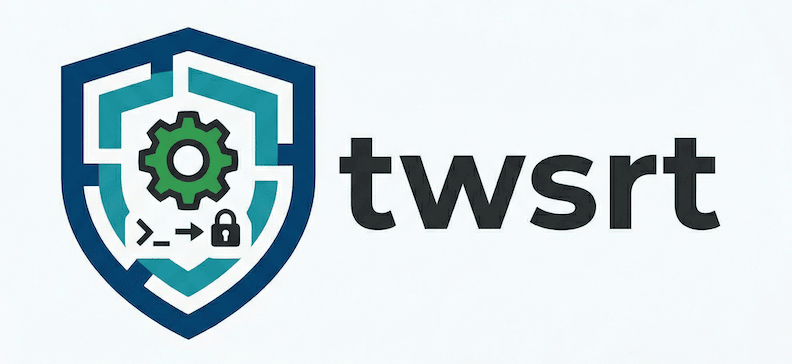

<p align="left">
  
</p>

Profile-driven security policy compiler — composes canonical JSONC fragments,
emits strict runtime configuration, and derives agent-specific controls.

## The Problem

AI coding agents (Claude Code, Copilot CLI, Codex, ...) each have their own permission
model and configuration format. Maintaining security rules per agent by hand leads to
configuration drift and coverage gaps.

Kernel sandboxes close part of the gap: [Anthropic Sandbox Runtime](https://github.com/anthropic-experimental/sandbox-runtime)
(SRT) — and by now each agent's own native sandbox — enforce OS-level filesystem and
network restrictions. **But a sandbox guards the process boundary: it covers the
commands an agent spawns.** An agent's built-in tools (Read, Write, Edit, WebFetch)
run *inside the agent's own process* and are **not** covered by a command-scoped
sandbox. The exceptions: wrapping the entire agent process (`srt -c "copilot ..."`),
or an agent like Codex that executes its work through sandboxed subprocesses.

## Solution: Composable Canonical Sources, Compiled per Profile and Agent

**The guiding idea — the Durable Core.** Security policy is maintained as
small, named JSONC fragments. A profile selects and inherits fragments for
every registered source kind. twsrt resolves that profile, composes each
source independently, rejects ambiguity, and emits strict canonical JSON
before deriving agent-specific configuration.

The durable security statement — *paths no agent may read or write, plus
domains agents may reach* — is therefore a compiled result, not a monolithic
file people edit. Its translation into native sandbox configuration remains
the foundation. Bash deny/ask rules and command flags are a per-agent
best-effort **supplement** where application-level controls are needed.

```
     DURABLE CORE  (kernel-enforced, high-fidelity everywhere)
       deny-paths + domains ──► Claude sandbox.* / Codex profile / SRT wrapper

     SUPPLEMENT    (app-enforced, best-effort, per-agent semantics)
       bash deny/ask rules  ──► Claude permissions / Copilot flags / Codex .rules
```

The compiler pipeline is the architectural center:

```
 config.toml
   source registries + profile inheritance
                    │
                    ▼
        resolve ordered fragment sets
                    │
                    ▼
      parse JSONC → compose → validate
                    │
          ┌─────────┴─────────┐
          ▼                   ▼
 compiled canonical JSON   normalized SecurityRule list
 ~/.srt-settings.json                 │
 bash-rules.json                      ▼
                           agent-specific generators
                          settings / flags / profiles


                ENFORCEMENT LAYERS
                ==================
     Layer 1 (OS):  kernel sandbox (SRT wrapper or agent-native)
                    — covers spawned commands, NOT built-in tools
     Layer 2 (App): agent permission rules — deny/ask for all tools,
                    the only control over built-in tools in-process
```

Commands get two layers of protection (kernel + app); built-in tools get one
(app rules only) — all generated from the **resolved profile** as the single
source of truth (see
[Security Boundaries & Invariants](#security-boundaries--invariants)).

How the two layers collaborate:


| Access Path | Kernel Sandbox (Layer 1) | Agent Permissions (Layer 2) | Depth |
|---|---|---|---|
| `Bash(cat ~/.aws/credentials)` | Kernel-enforced deny | Tool-level deny | Two layers |
| `Read(~/.aws/credentials)` | Not covered (in-process tool) | Tool-level deny | One layer |
| `Bash(curl evil.com)` | Network proxy blocks | Tool-level deny | Two layers |
| `WebFetch(evil.com)` | Not covered (in-process tool) | Tool-level allow check | One layer |


For the full security analysis and threat model see [SECURITY_CONCEPT.md](SECURITY_CONCEPT.md).

For the pi-mono integration see [pi-extensions/sandbox](https://github.com/sysid/pi-extensions/tree/main/packages/sandbox).

## Overview

`twsrt` compiles two registered canonical source kinds:

1. **SRT JSONC fragments** — composed into the strict JSON file
   `~/.srt-settings.json` used by Sandbox Runtime.
2. **Bash JSONC fragments** — composed into `bash-rules.json` and translated
   into APP-level command rules.

It generates security configurations for:

- **Claude Code** (`~/.claude/settings.json`) — permissions + sandbox configuration
- **Copilot CLI** — `--allow-tool` / `--deny-tool` flag snippets for the copilot
  launch command
- **Codex** (`~/.codex/config.toml` + `~/.codex/rules/twsrt.rules`) — a native
  user-level permission profile plus optional escalation rules

**Key invariant**: Only registered `.jsonc` fragments and `config.toml` are
edited by the user. Compiled canonical JSON and agent configs are generated
artifacts; `twsrt diff` detects drift in both layers.

### Compiler model

| Concept | Responsibility |
|---|---|
| Source kind | Defines one canonical document type, its fragment registry, compiled output, validation, and rule translation. `srt` and `bash` are currently registered. |
| Fragment | A named `.jsonc` object containing one reusable policy slice. Fragments never reference or include each other. |
| Profile | Selects ordered fragment names per source kind and may extend other profiles. |
| Resolved profile | Parent-first, stable-deduplicated fragment order used for one invocation. |
| Compiled document | Strict JSON produced by recursively composing one source kind's selected fragments. |
| Agent target | Configuration derived from the normalized rules after canonical compilation succeeds. |

Compilation is fail-fast. Objects merge recursively; arrays form a stable
deduplicated union; equal scalar values agree. Unequal scalars, incompatible
types, cycles, missing source selections, unknown fragments, and opposing
security actions fail with profile, path, and fragment context. Compilation
and target rendering complete before `generate --write` starts writing files,
so configuration conflicts cannot leave partial generated output.


### Usage

```bash
pip install twsrt
```

#### Open or initialize configuration

```bash
twsrt config --init           # Create starter TOML + JSONC fragments, then edit
twsrt config                  # Open the active config.toml in $EDITOR
```

#### Generate agent configs

```bash
twsrt generate claude         # Print Claude Code permissions to stdout
twsrt generate copilot        # Print Copilot CLI flags to stdout
twsrt generate codex          # Preview Codex profile + escalation rules
twsrt generate                # Generate for all agents
twsrt generate -p work        # Use a profile instead of default_profile

twsrt generate claude --write # Write to settings.full.json, symlink settings.json → it
twsrt generate claude -n -w   # Dry run: show what would be written
twsrt generate codex --write  # Merge profile and write twsrt.rules
```

#### Diagnostic output

Generated JSON, TOML, rules, and Copilot flags stay unstyled on stdout so they
remain safe to pipe into other commands. Human diagnostics use consistent
severity and streams: errors are red on stderr, warnings yellow on stderr,
informational notices cyan, successful writes and clean diffs green, and drift
yellow (unexpected extra entries are red). Colors are enabled only for an
interactive terminal; setting `NO_COLOR` (including to an empty value) disables
ANSI output explicitly.

Pass `--verbose` before the subcommand to add dim-cyan debug diagnostics on
stderr. Debug output reports lifecycle facts such as the selected profile,
mode, agent names, counts, target paths, and caught exception tracebacks. It
does not enumerate generated policy contents, rule patterns, domains,
environment values, or credentials. A traceback retains the same exception
message as the concise error, so malformed input may be named when that context
is necessary to fix the configuration.

#### Detect configuration drift

```bash
twsrt diff claude             # Compare generated vs existing target file
twsrt diff codex              # Compare owned profile + twsrt.rules
twsrt diff                    # Check all agents
twsrt diff --yolo             # Compare against yolo-specific config files
```

Exit codes: `0` = no drift, `1` = drift detected, `2` = missing file.

`diff` compiles the selected profile in memory and compares both the compiled
canonical JSON and generated agent configuration against the files on disk:

```
  JSONC fragments ──► [ compile profile in memory ]
                                  │
                       ┌──────────┴──────────┐
                       ▼                     ▼
              compiled canonical JSON   agent configuration
                       │                     │
                       └──── compare with files on disk
```

This detects two kinds of drift: unapplied fragment changes and out-of-band
modifications to either generated layer.

#### Typical workflow

```bash
twsrt config                  # Edit profiles and registered fragment paths
# Edit one or more JSONC fragments selected by the profile
twsrt generate claude         # Preview the change
twsrt generate claude --write # Apply (selective merge preserves hooks, MCP, etc.)
twsrt diff claude             # Verify: exit 0 = no drift
```


## Copilot Configuration (`generate copilot -w`)

Copilot has no settings file — it uses CLI flags. `twsrt generate copilot` produces a
line-continuation code snippet you paste into your launch command:

```
--allow-tool 'shell(*)' \
--allow-tool 'read' \
--allow-tool 'edit' \
--allow-tool 'write' \
--deny-tool 'shell(rm)' \
--deny-tool 'shell(sudo)' \
--allow-url 'github.com' \
--allow-url '*.github.com' \
```

**Lossy mapping**: Copilot has no `ask` tier, so ask rules are conservatively
mapped to `--deny-tool` (warned on stderr). `allowWrite` rules emit
`--allow-tool` flags (shell, read, edit, write); network deny rules emit
`--deny-url`.

**YOLO mode** (`generate --yolo copilot`): outputs `--yolo` as first flag,
followed by `--deny-tool` and `--deny-url` only. These flags are the only
app-layer control Copilot has, and nothing kernel-guards its tools —
**use YOLO only under an SRT wrapper**.

Deny rules take precedence over `--yolo`:

```
--yolo \
--deny-tool 'shell(rm)' \
--deny-tool 'shell(sudo)' \
--deny-url 'evil.com' \
```

Run copilot with sandbox `srt` as wrapper:

```bash
srt -c "copilot \
    --allow-tool 'shell(*)' \
    --allow-tool 'read' \
    --allow-tool 'edit' \
    --allow-tool 'write' \
    --deny-tool 'shell(rm)' \
    --deny-tool 'shell(rmdir)' \
    --deny-tool 'shell(dd)' \
    --deny-tool 'shell(mkfs)' \
    ...
```

## Claude Configuration (`generate claude -w`)

**Target file**: `~/.claude/settings.full|yolo.json` (configured via `claude_settings` in config.toml)

**Symlink**: `~/.claude/settings.json` → `settings.full|yolo.json` (created/updated automatically)

With `-w`, twsrt writes to `settings.full|yolo.json` and creates a symlink from
`settings.json` to the target. 

If `settings.json` is a regular file (e.g. first run), it is moved to `settings.full|yolo.json`
automatically.

Claude Code ships a native sandbox (Seatbelt/bwrap) configured via the
`sandbox` section — it covers sandboxed Bash commands. Built-in tools (Read,
Write, Edit, WebFetch) run inside the agent process, *outside* that sandbox,
and are guarded only by the generated `permissions` rules (best-effort).

**Selective merge**: `twsrt` updates only specific sections and preserves everything else:
- hooks, additionalDirectories, MCP allows, blanket tool allows, etc. are untouched

### Merge strategy per section

| Section | Strategy | Detail |
|---|---|---|
| `permissions.deny` | **Fully replaced** | |
| `permissions.ask` | **Fully replaced** | |
| `permissions.allow` | **Selective** | Only `WebFetch(domain:...)` entries replaced; existing allows preserved |
| `sandbox.network` | **Key-by-key merge** | unmanaged keys preserved |
| `sandbox.filesystem` | **Key-by-key merge** | unmanaged keys preserved |
| `sandbox.*` (top-level) | **Key-by-key merge** | `enabled`, `enableWeaker*`, `ignoreViolations` overwrite; Claude-only keys preserved |
| `hooks` | **Preserved** | Untouched |
| `additionalDirectories` | **Preserved** | Untouched |
| All other keys | **Preserved** | Untouched |

### Example: before and after `generate claude -w`

**Existing `~/.claude/settings.full.json`** (hand-maintained):

```json
{
  "permissions": {
    "deny": [
      "Bash(old-deny-entry)"
    ],
    "ask": [
      "Bash(old-ask-entry)"
    ],
    "allow": [
      "Read",
      "Glob",
      "Grep",
      "WebSearch",
      "Bash(npm test:*)",
      "mcp__memory__store",
      "WebFetch(domain:old.example.com)"
    ]
  },
  "hooks": {
    "PreToolUse": [
      { "matcher": "Bash", "hooks": [{ "type": "command", "command": "my-hook" }] }
    ]
  },
  "additionalDirectories": ["/home/user/other-project"],
  "sandbox": {
    "network": {
      "allowedDomains": ["old.example.com"],
      "allowLocalBinding": true
    },
    "autoAllowBashIfSandboxed": true,
    "excludedCommands": ["docker"]
  }
}
```

**After `twsrt generate claude -w`** (with SRT rules for `github.com`, `*.github.com`,
bash deny `rm`/`sudo`, bash ask `git push`, denyRead `~/.aws`):

```json
{
  "permissions": {
    "deny": [
      "Read(~/.aws)",
      "Read(~/.aws/**)",
      "Edit(~/.aws)",
      "Edit(~/.aws/**)",
      "Bash(rm)",
      "Bash(rm *)",
      "Bash(sudo)",
      "Bash(sudo *)"
    ],
    "ask": [
      "Bash(git push)",
      "Bash(git push *)"
    ],
    "allow": [
      "Read",
      "Glob",
      "Grep",
      "WebSearch",
      "Bash(npm test:*)",
      "mcp__memory__store",
      "WebFetch(domain:github.com)",
      "WebFetch(domain:*.github.com)"
    ]
  },
  "hooks": {
    "PreToolUse": [
      { "matcher": "Bash", "hooks": [{ "type": "command", "command": "my-hook" }] }
    ]
  },
  "additionalDirectories": ["/home/user/other-project"],
  "sandbox": {
    "network": {
      "allowedDomains": ["github.com", "*.github.com"],
      "allowLocalBinding": true
    },
    "autoAllowBashIfSandboxed": true,
    "excludedCommands": ["docker"]
  }
}
```

**YOLO mode** (`generate --yolo claude -w`): Same selective merge, only the `permissions.ask`
section is removed.

Target defaults to `settings.yolo.json`.

**What changed** (twsrt-managed) vs **what didn't** (user-managed):

```
  permissions.deny          ← REPLACED (old-deny-entry gone, new rules from SRT + bash-rules)
  permissions.ask           ← REPLACED (old-ask-entry gone, new rules from bash-rules)
  permissions.allow
    ├─ Read, Glob, ...      ← PRESERVED (not WebFetch entries)
    ├─ Bash(npm test:*)     ← PRESERVED (not WebFetch entries)
    ├─ mcp__memory__store   ← PRESERVED (not WebFetch entries)
    └─ WebFetch(domain:...) ← REPLACED (old.example.com gone, github.com added)
  hooks                     ← PRESERVED (untouched)
  additionalDirectories     ← PRESERVED (untouched)
  sandbox.network
    ├─ allowedDomains       ← REPLACED (managed by twsrt)
    └─ allowLocalBinding    ← PRESERVED (was already there, merge keeps it)
  sandbox.autoAllowBash...  ← PRESERVED (Claude-only key, invisible to twsrt)
  sandbox.excludedCommands  ← PRESERVED (Claude-only key, invisible to twsrt)
```

## Codex Configuration (`generate codex -w`)

Codex ships its own always-on kernel sandbox. twsrt compiles the canonical
filesystem and network policy into a native permission profile named `twsrt`,
selected via `default_permissions`. The profile extends the built-in
`:workspace` base (workspace + tmp writable, `.git`/`.codex`/`.agents`
protected) and adds:

- Absolute and home-relative `allowWrite` paths → reusable workspace roots;
  a terminal `/**` or trailing slash is normalized to the concrete
  directory. Named relative paths → workspace filesystem `write` rules, which
  can intentionally reopen a Codex-protected path such as `.git`; `.` alone is
  omitted because the runtime workspace already covers it. Unsupported
  absolute shapes (`~`, `/`, other wildcards) and roots also matched by a deny
  rule are skipped with a warning — the deny wins.
- `denyRead` paths → filesystem `deny` (blocks Codex's default read-everything)
- `denyWrite` exact paths → `read`; `denyWrite` globs → `deny` (stricter,
  fail-safe — Codex cannot express read-only for globs; warned)
- `allowedDomains`/`deniedDomains` → network `domains` allowlist. The
  `domains` table is always emitted, even empty: an empty map blocks all
  domain traffic, matching SRT allowlist semantics.
- Exact Unix socket paths → `unix_sockets` allow entries

Added workspace roots inherit the `:workspace` write policy and every rule in
`filesystem.:workspace_roots`, so canonical deny globs constrain them without
repeating `"." = "write"`.

For example, permit fetch/pull metadata updates while keeping repository-local
configuration and hooks read-only:

```toml
[permissions.twsrt.filesystem.":workspace_roots"]
".git" = "write"
".git/config" = "read"
".git/hooks" = "read"
```

**Deliberately NOT compiled** (each skip is warned at generation time):

- **bash-rules `allow` commands.** In Codex, an `allow` execution rule means
  "run **outside the sandbox** without prompting" — auto-approved unsandboxed
  execution, strictly weaker than the default (prompt on every escalation).
- **bash-rules `ask` commands.** Codex already prompts for every
  out-of-sandbox request; restating the default adds bulk, not security.

`~/.codex/rules/twsrt.rules` thus contains only `deny` → `forbidden` prefix
rules (hard deny instead of prompt for sandbox-escape requests). These rules
govern **only requests to execute outside the sandbox** — a command running
inside the sandbox never consults them. Codex output is identical in yolo and
full mode.

The user-level targets require no root access:

- `~/.codex/config.toml` — selectively merged; only `default_permissions`,
  `approval_policy`, `approvals_reviewer`, `allow_login_shell`, and
  `[permissions.twsrt]` are owned by twsrt.
- `~/.codex/rules/twsrt.rules` — fully generated from `bash-rules.json`.
  **Optional**: generated only while `codex_rules` is set in config.toml;
  omit the key to skip escalation rules entirely and rely on Codex's default
  prompt-on-every-escalation (security delta: escalations prompt instead of
  hard-deny, and TUI-saved allowlist entries take effect).

Restart Codex after generation. Active sessions do not reload permission
profiles or `.rules` files.

> **WARNING — silent profile deactivation**: if a legacy `sandbox_mode` /
> `sandbox_workspace_write` setting appears in *any* loaded Codex config layer
> (managed, team, project, config profile) or `--sandbox` is passed on the CLI,
> Codex silently ignores `default_permissions` — no error is raised. twsrt
> fails fast only for the managed `config.toml` it owns and prints this
> reminder on every generate/diff. Run `codex doctor` after changing other
> layers. Note: Codex permission profiles are Beta and `.rules` files are
> Experimental upstream; expect churn.

All other Codex configuration is preserved, including projects, MCP servers,
headers, WebSearch, apps, and `shell_environment_policy`. Preview and diff
output contain only managed security data, so foreign credentials are never
printed.

Some SRT fields cannot be translated without widening access. Codex generation
therefore skips them with warnings: `allowLocalBinding`, socket directory
entries, integer proxy ports, Mach lookup, violation-reporting exceptions, and
weaker-isolation switches. A disabled canonical SRT sandbox or a malformed
`/~/...` path fails generation.

## Configuration

[SRT](https://github.com/anthropic-experimental/sandbox-runtime) is needed only
for wrapping a whole agent (e.g. `srt -c "copilot --yolo ..."`) — Claude Code
and Codex bring native sandboxes. 

> GOTCHA: [sandbox write allowlist is hardcoded and currently cannot be managed in claude-code](https://github.com/anthropics/claude-code/issues/10377#issuecomment-3468689124)

### SRT JSONC fragments and `~/.srt-settings.json`

[SRT configuration](https://github.com/anthropic-experimental/sandbox-runtime?tab=readme-ov-file#configuration)
defines OS-level enforcement boundaries. Human-maintained policy lives in one
or more JSONC fragments; `twsrt generate --write` composes the selected
profile and writes strict JSON to `~/.srt-settings.json` for SRT and the agent
generators.

```jsonc
{
  // Comments are allowed in canonical fragments.
  "filesystem": {
    "denyRead":  ["~/.aws", "~/.ssh", "~/.gnupg", "~/.netrc"],
    "denyWrite": ["**/.env", "**/*.pem", "**/*.key", "**/secrets/**"],
    "allowWrite": [".", "/tmp", "~/dev"]
  },
  "network": {
    "allowedDomains": [
      "github.com", "*.github.com",
      "pypi.org", "*.pypi.org",
      "registry.npmjs.org"
    ]
  }
}
```

JSONC supports `//` and `/* ... */` comments. It otherwise remains strict JSON:
trailing commas, duplicate object keys, and non-finite numbers are rejected.
See the comprehensive [SRT JSONC example](example/srt-settings.jsonc).


### `~/.config/twsrt/config.toml`

`config.toml` is the registry and selection layer; it does not contain policy
rules itself. Schema version 1 has four responsibilities:

1. register each canonical source kind and its strict JSON output;
2. name the JSONC fragments available to that source kind;
3. define profiles as fragment selections plus optional parent profiles;
4. configure downstream agent targets and mode-specific overrides.

Relative fragment and output paths resolve from the directory containing
`config.toml`; home-relative and absolute paths are also supported. The legacy
flat `[sources]` path schema is intentionally rejected rather than guessed.

Minimal config (generated by `twsrt config --init`):

```toml
schema_version = 1
default_profile = "default"

[sources.srt]
output = "~/.srt-settings.json"

[sources.srt.fragments.base]
path = "srt/base.jsonc"

[sources.bash]
output = "bash-rules.json"

[sources.bash.fragments.base]
path = "bash/base.jsonc"

[profiles.default]
srt = ["base"]
bash = ["base"]

[targets]
claude_settings = "~/.claude/settings.full.json"
codex_config = "~/.codex/config.toml"
codex_rules = "~/.codex/rules/twsrt.rules"    # optional: omit to skip escalation rules
```

Profiles may extend other profiles. Parent fragments are composed before child
fragments, and repeated fragment names and array values are deduplicated while
preserving their first occurrence:

```toml
schema_version = 1
default_profile = "default"

[sources.srt]
output = "~/.srt-settings.json"
[sources.srt.fragments.base]
path = "srt/base.jsonc"
[sources.srt.fragments.work]
path = "srt/work.jsonc"

[sources.bash]
output = "bash-rules.json"
[sources.bash.fragments.base]
path = "bash/base.jsonc"

[profiles.default]
srt = ["base"]
bash = ["base"]

[profiles.work]
extends = ["default"]
srt = ["work"]

[targets]
claude_settings = "~/.claude/settings.full.json"
codex_config = "~/.codex/config.toml"
codex_rules = "~/.codex/rules/twsrt.rules"    # optional: omit to skip escalation rules
copilot_output = "~/.config/twsrt/copilot-flags.txt"    # optional, stdout if omitted

# YOLO target overrides (optional — defaults to inserting .yolo before extension)
# claude_settings_yolo = "~/.claude/settings.yolo.json"
# copilot_output_yolo = "~/.config/twsrt/copilot-flags.yolo.txt"

# Mode-specific sandbox overrides (applied after SRT values, take precedence)
[sandbox_overrides.yolo]
enabled = true
autoAllowBashIfSandboxed = true
allowUnsandboxedCommands = false

[sandbox_overrides.full]
enabled = false
```

Every resolved profile must select at least one fragment for every configured
source kind. Select one with `twsrt generate --profile work <agent>`.
Composition recursively merges objects and unions arrays. Conflicting scalar
values, incompatible value types, SRT allow/deny overlaps, and Bash
allow/ask/deny overlaps fail with the conflicting path and source fragments.

`default_profile` is used when `--profile` is omitted. Profile inheritance is
selection reuse, not override precedence: a child can add fragments, but it
cannot silently replace a conflicting parent value. Model intentional variants
as separate profiles that share a non-conflicting base.

Sandbox overrides let you enforce different sandbox postures per mode.
When `--yolo` is used, overrides from `[sandbox_overrides.yolo]` are applied;
otherwise `[sandbox_overrides.full]` is used. These override SRT-sourced values
and flow through selective merge to update existing settings files.

Typical use: `claude-yolo` enforces sandbox (safety net when skipping
permission prompts), while `claude-full` disables it (user approves each action
interactively).

### Bash JSONC fragments

```jsonc
{
  // Commands are composed by the selected profile.
  "allow": ["gh pr view"],
  "deny": ["rm", "sudo", "git push --force"],
  "ask": ["git push", "git commit", "pip install"]
}
```

The compiled strict JSON is written to the `sources.bash.output` path and then
used for agent-specific generation.
See the comprehensive [Bash JSONC example](example/bash-rules.jsonc).


## Rule and Security Mappings
### Rule Mapping

| SRT / Bash Rule | Claude Code | Copilot CLI | Codex |
|-----------------|-------------|-------------|-------|
| denyRead directory | Tool(path) + Tool(path/**) in deny | (SRT enforces) | filesystem `deny` |
| denyRead file | Tool(path) in deny | (SRT enforces) | filesystem `deny` |
| denyWrite exact path | Edit(path) in deny | (SRT enforces) | filesystem `read` |
| denyWrite glob | Edit(pattern) in deny | (SRT enforces) | filesystem `deny` (stricter; warns) |
| allowWrite absolute/home path | (no output) | --allow-tool flags | profile workspace root |
| allowWrite relative path | (no output) | --allow-tool flags | named path → filesystem `write`; `.` omitted |
| allowedDomains domain | WebFetch(domain:X) + sandbox.network | (SRT enforces) | domain `allow` |
| deniedDomains domain | WebFetch(domain:X) in deny | --deny-url | domain `deny` |
| Bash allow cmd | (no output) | (no output) | not compiled (would auto-approve unsandboxed; warns) |
| Bash deny cmd | Bash(cmd) + Bash(cmd *) in deny | --deny-tool 'shell(cmd)' | prefix `forbidden` |
| Bash ask cmd | Bash(cmd) + Bash(cmd *) in ask | --deny-tool (lossy, warns) | not compiled (Codex prompts by default; warns) |

**YOLO mode differences**: Bash ask rules are skipped entirely. Copilot `--allow-*`
flags are omitted (subsumed by `--yolo`). Claude `permissions.ask` key is removed.
Codex output is identical in yolo and full mode.

Where Tool = Read, Edit. Claude Code matches file permissions on `Edit(path)`
only — a single `Edit` rule covers every file-editing tool (Write, Edit,
NotebookEdit), so no separate `Write(path)` rule is emitted. Directory vs file
detection uses the filesystem at generation time; glob patterns and unknown
paths are treated as bare patterns (no `/**` suffix for globs, `/**` added for
unknown paths).

### Sandbox Key Mapping

Claude Code's `sandbox` section has 17 configurable keys. twsrt manages a subset of them
(sourced from `.srt-settings.json`) and never touches the rest:

| Claude Code Key | SRT Source | Status |
|---|---|---|
| `sandbox.network.allowedDomains` | `network.allowedDomains` | **Managed** |
| `sandbox.network.deniedDomains` | `network.deniedDomains` | **Managed** |
| `sandbox.network.allowLocalBinding` | `network.allowLocalBinding` | **Managed** (pass-through) |
| `sandbox.network.allowUnixSockets` | `network.allowUnixSockets` | **Managed** (pass-through) |
| `sandbox.network.allowAllUnixSockets` | `network.allowAllUnixSockets` | **Managed** (pass-through) |
| `sandbox.network.httpProxyPort` | `network.httpProxyPort` | **Managed** (pass-through) |
| `sandbox.network.socksProxyPort` | `network.socksProxyPort` | **Managed** (pass-through) |
| `sandbox.filesystem.allowWrite` | `filesystem.allowWrite` | **Managed** (pass-through) |
| `sandbox.filesystem.denyWrite` | `filesystem.denyWrite` | **Managed** (pass-through) |
| `sandbox.filesystem.denyRead` | `filesystem.denyRead` | **Managed** (pass-through) |
| `sandbox.enabled` | `enabled` | **Managed** (pass-through) |
| `sandbox.enableWeakerNetworkIsolation` | `enableWeakerNetworkIsolation` | **Managed** (pass-through) |
| `sandbox.enableWeakerNestedSandbox` | `enableWeakerNestedSandbox` | **Managed** (pass-through) |
| `sandbox.ignoreViolations` | `ignoreViolations` | **Managed** (pass-through) |
| `sandbox.excludedCommands` | *(no SRT source)* | **Claude-only** — never generated, never removed |
| `sandbox.autoAllowBashIfSandboxed` | *(no SRT source)* | **Claude-only** — preserved by default; overridable via `[sandbox_overrides]` |
| `sandbox.allowUnsandboxedCommands` | *(no SRT source)* | **Claude-only** — preserved by default; overridable via `[sandbox_overrides]` |

**Pass-through** keys are copied verbatim from SRT to Claude settings without transformation.
If a key is absent from SRT, it is omitted from generated output (never set to a default).

**Claude-only** keys exist only in Claude Code's schema and have no SRT equivalent.
By default `twsrt generate` never creates them, and `twsrt generate --write` preserves
them via selective merge. However, `[sandbox_overrides]` in config.toml can explicitly
set any sandbox key (including Claude-only keys like `autoAllowBashIfSandboxed`) per mode,
allowing different sandbox postures for yolo vs full mode.

## Security Boundaries & Invariants

What each agent actually enforces, where, and what twsrt deliberately does
not compile. This is the authoritative summary; details per agent above.

### Per-agent boundary matrix

| Boundary | Claude Code | Copilot CLI | Codex |
|---|---|---|---|
| Enforcement point | app permission engine | CLI flags (per-invoke) | sandbox profile + escalation rules |
| Built-in tools (Read/Edit/WebFetch) | in agent process, **outside** native sandbox — app rules only | in agent process — flags only, no kernel guard | work runs as sandboxed subprocesses — profile applies |
| File deny | best-effort tool deny | none (SRT only) | profile-enforced (all access) |
| ask tier | native | ABSENT → deny (lossy) | native default; not restated |
| allow tier | emitted | --allow-tool | filesystem roots compiled; Bash allow not compiled |
| In-sandbox commands | Bash rules apply | rules apply | NOT governed by .rules |
| Pinned invariants | managed sections merge | (stateless) | default_permissions, approval_policy, approvals_reviewer, allow_login_shell |
| Known trap | allowWrite hardcoded ([#10377](https://github.com/anthropics/claude-code/issues/10377)) | ask→deny fidelity loss | sandbox_mode in ANY layer disables profile |

### How canonical sources compile per agent

`∅` = deliberately not compiled (with a generation-time warning where noted):

```
srt denyRead ────► claude deny(Read/Edit) ─► copilot ∅ (SRT) ──► codex fs "deny"
srt denyWrite ───► claude deny(Edit)      ─► copilot ∅ (SRT) ──► codex "read"/glob "deny" (warn)
srt allowWrite ──► claude ∅ (hardcoded!)  ─► copilot allow-*  ─► codex workspace roots
bash allow ──────► claude ∅               ─► copilot ∅        ─► codex ∅ warn (would unsandbox)
bash ask ────────► claude ask             ─► copilot deny warn ─► codex ∅ warn (default prompts)
bash deny ───────► claude deny            ─► copilot deny      ─► codex "forbidden" (escalation only)
```

### Invariants

1. **The resolved profile is the single source of truth for an invocation.**
   Registered JSONC fragments are human-maintained inputs. Compiled canonical
   JSON and agent configs are artifacts; `twsrt diff` detects drift in both.
2. **Canonical allows widen only the named sandbox boundary.** SRT
   `allowWrite` directories become Codex workspace roots, retaining inherited
   protected paths and deny globs. Lossy translations narrow or skip with a
   warning; Bash allows never become unsandboxed execution.
3. **Selective merge owns only declared sections.** Everything else in a
   target file (hooks, MCP servers, projects, credentials) is preserved
   byte-for-byte where the format allows.
4. **Fail-safe on ambiguity.** Disabled canonical sandbox, malformed paths,
   conflicting fragments, incomplete profiles, and legacy Codex
   `sandbox_mode` in the managed file abort generation instead of guessing.

### Scope & Roadmap

Canonical-source composition is deliberately separate from agent generation.
Adding a source kind means registering its name, validating its compiled
document, and translating it into normalized rules; profile resolution and
structural composition are reused unchanged. Adding an agent consumes the
existing normalized rules and does not alter canonical fragments or profiles.

All three agents now ship native OS sandboxes (Claude Code: built-in
Seatbelt/bwrap, opt-in; Copilot CLI: local sandbox in public preview; Codex:
kernel sandbox always-on) — the [Durable Core](#solution-composable-canonical-sources-compiled-per-profile-and-agent)
compiles into each of them. The bash-rules app layer is the per-agent
best-effort supplement:

- **Bash-rules translation is Claude-primary and frozen for new agents.**
  Claude gets full deny/ask fidelity (tool-level gate); Copilot keeps
  deny-only flags (deny takes precedence over `--yolo` — the only app-layer
  control in yolo mode); Codex gets forbidden-only escalation rules. New
  agents get restrictions-only compilation by default.
- **Copilot native sandbox** (`sandbox` key in Copilot settings.json) is the
  intended future replacement for the flag-snippet generator — deferred while
  the feature is in public preview (backend undocumented, subject to change).
  See `thoughts/tickets/2026-07-18-copilot-native-sandbox-target.md`.

## Development

```bash
make test              # Run tests
make lint              # Ruff lint
make format            # Ruff format
make ty                # Type check with ty
make static-analysis   # All of the above
```
