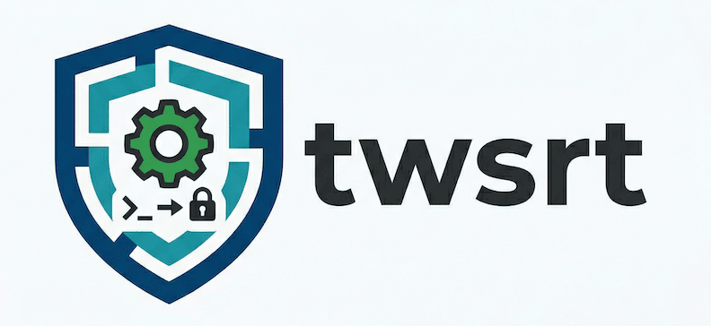
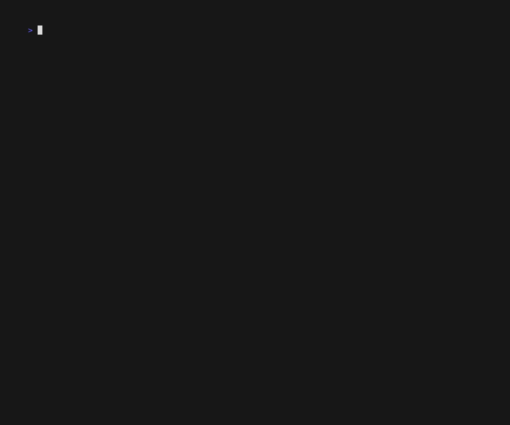

<p align="left">
  
</p>

One security policy, compiled into the native permission and sandbox
configuration of every AI coding agent you run.



## Contents

1. [Why twsrt](#why-twsrt)
2. [How it works](#how-it-works) — three pictures
3. [Use cases at a glance](#use-cases-at-a-glance)
4. [Install and quickstart](#install-and-quickstart)
5. [Configuration](#configuration)
6. [Per-project policy](#per-project-policy)
7. [Agents](#agents)
8. [Verifying the policy](#verifying-the-policy)
9. [Security at a glance](#security-at-a-glance)
10. [Commands](#commands)
11. [Documentation map](#documentation-map) · [Development](#development)

## Why twsrt

Claude Code, Codex and Copilot CLI each have their own permission model and
config format. Maintaining "never read `~/.aws`, never run `sudo`, only reach
`github.com`" three times by hand drifts and leaves gaps. twsrt keeps that
policy once and compiles it into every agent:

```
                 ┌───────────────────────────┐
   you edit ───► │  policy fragments (JSONC) │   never read ~/.aws · never run sudo
                 │  + profiles (config.toml) │   only reach github.com · ask before git push
                 └─────────────┬─────────────┘
                               │ twsrt generate -w
          ┌──────────────┬─────┴────────┬────────────────┐
          ▼              ▼              ▼                ▼
   ~/.srt-settings   Claude Code      Codex          Copilot CLI
   (SRT sandbox)     settings.json    config.toml    launch flags
                                      + .rules
```

## How it works

Three ideas explain the whole tool.

### 1. One policy, compiled in two stages

```
 stage 1: compile — depends on the profile only
 ───────────────────────────────────────────────────────────────────────
 fragments ─(profile)─► compose ─► canonical config (in memory)
                                    ├─ srt  ──► ~/.srt-settings.json ──► read by SRT
                                    └─ bash ──► bash-rules.json
                                         │
                                         ▼  parse
                              normalized rules + sandbox/network/filesystem config
                                         │
 stage 2: translate — agent argument picks which generators run
 ───────────────────────────────────────────────────────────────────────
              ┌──────────────────────────┼──────────────────────────┐
              ▼                          ▼                          ▼
       Claude generator           Codex generator           Copilot generator
       settings.full.json         config.toml + .rules      CLI flags

 twsrt show            prints stage 1      generate <agent>      prints stage 2
 generate <agent> -w   writes stage 1 (all of it) + stage 2 (that agent)
```

> **The canonical config is the input for every agent translation.**
> `~/.srt-settings.json` and `bash-rules.json` are the compiled policy of one
> profile: the single source of truth. SRT reads `~/.srt-settings.json`
> directly; every agent config is translated from the same compile. These
> paths assume `output = "~/.srt-settings.json"`; an omitted `output` writes
> `srt-settings.json` next to `config.toml`, which srt reads only via
> `srt -s` ([config.toml](#configtoml)).

| | Canonical config | Agent configs |
|---|---|---|
| Files | `~/.srt-settings.json`, `bash-rules.json` | Claude `settings.full.json`, Codex `config.toml` + `.rules`, Copilot flags |
| Role | Source of truth; SRT enforcement file | Lossy translations into each agent's native model |
| Depends on | Profile only | Canonical config + agent + `--yolo` |
| Inspect | `twsrt show [srt\|bash]` | `twsrt generate <agent>` |
| Written by | **every** `generate -w`, whichever agent is selected | `generate <that agent> -w` |

Consequences:

- **`twsrt generate copilot -w` writes `~/.srt-settings.json`.** The agent argument only selects
  which translations run.
- **Never hand-edit generated files.** ; the next `generate -w` overwrites a hand edit, and `twsrt
  diff` reports it as drift. Edit the fragments (`twsrt edit`) instead.
- **Nothing is written unless everything compiles.** A conflict between fragments fails fast.

### 2. Two enforcement layers

The same policy is enforced twice, by two different mechanisms:

```
  agent (Node, Rust, …)
  ┌───────────────────────────────────────────────────────────────┐
  │  built-in tools: Read · Edit · WebFetch      ◄── layer 2 only │
  │        │                                                      │
  │  layer 2: agent permissions (deny / ask / allow, all tools)   │
  │        │                                                      │
  │        └─► Bash tool ──spawns──┐                              │
  └────────────────────────────────┼──────────────────────────────┘
                                   ▼
  ┌───────────────────────────────────────────────────────────────┐
  │  layer 1: kernel sandbox (Seatbelt / bubblewrap + net proxy)  │
  │  every spawned command: deny paths, write allowlist, domains  │
  └───────────────────────────────────────────────────────────────┘
```

| Access | Layer 1: kernel sandbox | Layer 2: agent permissions |
|---|---|---|
| `Bash(cat ~/.aws/credentials)` | denied | denied |
| `Read(~/.aws/credentials)` | not covered (in-process) | denied |
| `Bash(curl evil.com)` | proxy blocks | denied |
| `WebFetch(evil.com)` | not covered (in-process) | allow check |
| `Bash(git push)` vs `Bash(ls)` | cannot tell them apart | deny / ask per command |

The kernel layer (deny paths, write allowlist, allowed domains) is the
durable core and translates with high fidelity into every agent. The Bash
deny/ask rules are a per-agent supplement. Why both are needed:
[SECURITY_CONCEPT.md](SECURITY_CONCEPT.md#3-security-principles).

### 3. Profiles choose which fragments are active

A fragment is one slice of policy. A profile is a combination of fragments.
Profiles extend each other but only ever *add*:

```
                     fragment pool (the policy)
 profile  │ srt/base  srt/cloud-creds  srt/work  bash/base │ typical use
 ─────────┼────────────────────────────────────────────────┼───────────────────────────
 default  │    ●             ●                       ●     │ the global files
 work     │    ●             ●            ●          ●     │ extends default, adds work
 slim     │    ●                                     ●     │ one repo, via --project
```

- **Children add, they never override.** A scalar the parent sets cannot be
  changed by a child; that is a compile error, so no profile can silently
  weaken another.
- **One profile is in force at a time** for the global files: `generate -w -p work` and `generate
  -w` write the same files and the last run wins.
- **A project can drop a rule by choosing a profile without that fragment**,
  compiled into a project repository instead of the global files — see
  [Per-project policy](#per-project-policy).

## Use cases at a glance

| I want to … | Run | More |
|---|---|---|
| Start from scratch | `twsrt config --init` | [Quickstart](#install-and-quickstart) |
| Change the policy | `twsrt edit` → `twsrt generate -w <agent>` | [Configuration](#configuration) |
| See what an agent would get, without writing | `twsrt generate <agent>` | [Agents](#agents) |
| See the compiled sandbox file | `twsrt show` | [How it works](#1-one-policy-compiled-in-two-stages) |
| Run an agent without permission prompts, sandbox as safety net | `twsrt generate --yolo -w <agent>` | [Modes](#claude-code) |
| Use a different policy set on this machine | `twsrt generate -w -p work <agent>` | [Profiles](#3-profiles-choose-which-fragments-are-in-force) |
| Relax one rule for one repository only | `twsrt generate claude -w -p slim --project` | [Per-project policy](#per-project-policy) |
| Check nobody edited generated files | `twsrt diff` | [Verifying](#verifying-the-policy) |
| Prove the sandbox actually blocks what the policy says | `twsrt test` | [Verifying](#verifying-the-policy) |
| Find redundant rules and pattern traps | `twsrt doctor` | [Verifying](#verifying-the-policy) |

## Install and quickstart

```bash
uv tool install twsrt        # or: pip install twsrt

twsrt config --init          # writes ~/.config/twsrt/config.toml + starter fragments
twsrt edit                   # opens every fragment: deny paths, domains, command rules
twsrt config                 # enable agents: [targets] claude_settings = "~/.claude/settings.full.json"

twsrt show                   # print the compiled canonical srt settings
twsrt generate claude        # preview the Claude translation and the files -w would write
twsrt generate claude -w     # write the canonical outputs + ~/.claude/settings.full.json
twsrt diff                   # exit 0 when every target matches the fragments
twsrt test                   # prove the sandbox enforces the policy (plain terminal)
```

A common launch pattern regenerates the active mode on every start:

```bash
claude-full() { twsrt generate -w claude; claude "$@"; }
claude-yolo() { twsrt generate --yolo -w claude; claude --allow-dangerously-skip-permissions "$@"; }
```

## Configuration

Only `config.toml` and the `.jsonc` fragments are edited by hand. Relative
paths resolve from the directory containing `config.toml`; `~` and absolute
paths also work. `twsrt config --init` writes a fully commented version.

Every compile write-denies `config.toml` and every `[sources]` path (outputs
and fragments), so a sandboxed agent cannot loosen its own policy: edit them
from a plain terminal
([why](SECURITY_CONCEPT.md#34-least-privilege-denyread-implies-denywrite)).

| Term | Meaning |
|---|---|
| Source kind | A canonical document type: `srt` (filesystem and network policy, required) and `bash` (command allow/ask/deny lists, optional) |
| Fragment | One named `.jsonc` file holding a slice of policy for one source kind. Fragments never include each other |
| Profile | An ordered selection of fragments per source kind; may `extend` other profiles. `default_profile` applies when `-p` is omitted |
| Target | An agent config file translated from the canonical output |
| Mode | `full` (default) keeps ask rules and interactive approval. `--yolo` drops ask rules and writes separate `*.yolo.*` targets, for launches that skip permission prompts |

### config.toml

```toml
schema_version = 1
default_profile = "default"

# --- canonical sources: one compiled output, one or more fragments each ---
[sources.srt]
output = "~/.srt-settings.json"   # optional, see below
[sources.srt.fragments.base]
path = "srt/base.jsonc"
[sources.srt.fragments.work]
path = "srt/work.jsonc"

[sources.bash]                    # optional; output omitted: bash-rules.json next to config.toml
[sources.bash.fragments.base]
path = "bash/base.jsonc"

# --- profiles: fragment selections; children add, they never override ---
[profiles.default]
srt = ["base"]
bash = ["base"]

[profiles.work]
extends = ["default"]
srt = ["work"]

# --- targets: agents are opt-in; an unset key means "agent not configured" ---
[targets]
claude_settings = "~/.claude/settings.full.json"   # must not be settings.json (symlink anchor)
codex_config    = "~/.codex/config.toml"
codex_rules     = "~/.codex/rules/twsrt.rules"      # optional, needs codex_config: escalation rules
copilot_output  = "~/.config/twsrt/copilot-flags.txt"
# claude_settings_yolo / copilot_output_yolo: optional, each needs its full-mode key;
# default inserts ".yolo" before the suffix

# --- Claude: keep unmanaged settings in sync between full and yolo files ---
[claude_sync]
mode_specific = ["skipDangerousModePermissionPrompt", "skipAutoPermissionPrompt"]

# --- Claude: sandbox posture per mode, applied after SRT values ---
[sandbox_overrides.yolo]
enabled = true
autoAllowBashIfSandboxed = true
allowUnsandboxedCommands = false

[sandbox_overrides.full]
enabled = false
```

Only `schema_version`, `default_profile`, `[sources.srt]` and one profile are
required. Without `[sources.bash]` no command rules exist: nothing is compiled
to `bash-rules.json` and no agent gets Bash allow/ask/deny entries; a profile
must then not name `bash`. `config --init` writes exactly the required keys,
plus `[sandbox_overrides.yolo]`, and leaves every other key, `[sources.bash]`
included, commented out with its default value.

`output` is optional per source kind and defaults to `srt-settings.json` /
`bash-rules.json` next to `config.toml`. srt itself reads only
`~/.srt-settings.json`, and when that file is missing it runs with built-in
defaults, without any `denyRead`. With the default `output`, launch
`srt -s <config dir>/srt-settings.json`, or set
`output = "~/.srt-settings.json"` so a bare `srt` picks up the policy.

An agent is configured only when its `[targets]` key is set. `generate` and
`diff` treat every agent the same way:

| Agent argument | Agent configured | Agent not configured |
|---|---|---|
| `all` (default) | previewed / written / diffed | skipped, with a note on stderr |
| named, e.g. `codex` | previewed / written / diffed | error, exit 1, no output |

If no agent is configured, `generate -w` writes only the canonical outputs.

### Fragments

SRT fragments follow the
[SRT configuration schema](https://github.com/anthropic-experimental/sandbox-runtime?tab=readme-ov-file#configuration);
Bash fragments hold three command lists. JSONC comments are allowed;
trailing commas, duplicate keys and non-finite numbers are rejected.

```jsonc
// srt/base.jsonc                                   // bash/base.jsonc
{                                                   {
  "filesystem": {                                     "allow": ["gh pr view"],
    "denyRead":  ["~/.aws", "~/.ssh", "~/.gnupg"],    "deny":  ["rm", "sudo", "git push --force"],
    "denyWrite": ["**/.env", "**/*.pem"],             "ask":   ["git push", "git commit"]
    "allowWrite": [".", "/tmp", "~/dev"]            }
  },
  "network": {
    "allowedDomains": ["github.com", "*.github.com", "pypi.org"]
  }
}
```

| SRT key | Meaning |
|---|---|
| `denyRead` | Paths the agent cannot read. **Also compiled into `denyWrite`**: a path secret enough to hide is never meant to be rewritten ([ADR 0001](doc/adr/0001-deny-read-implies-deny-write.md)) |
| `denyWrite` | Paths or globs the agent cannot write, even inside a write root |
| `allowWrite` | The write allowlist: every write outside it is denied |
| `allowedDomains` | The network allowlist: every other host is blocked |

| Bash key | Meaning |
|---|---|
| `deny` | Block the command (and its subcommands) |
| `ask` | Prompt before running it; agents without an ask tier get a deny |
| `allow` | Validated against `ask`/`deny`, but compiled into no agent today: Codex would read it as "run outside the sandbox", so it is skipped with a warning |

**Composition.** Fragments of a profile merge into one document: objects
merge recursively, arrays form a union, equal scalars agree. Unequal
scalars and a value in opposing buckets (`allowWrite` and `denyWrite`,
`ask` and `deny`, `denyRead` and `allowWrite`) fail with the path and both
fragments. Rule arrays are sorted, so the output does not depend on
fragment order. Full rules: [Compiler model](doc/REFERENCE.md#compiler-model).
Complete examples: [example/srt-settings.jsonc](example/srt-settings.jsonc),
[example/bash-rules.jsonc](example/bash-rules.jsonc).

## Per-project policy

A repository gets its own policy by choosing a profile, compiled into the
repository and loaded per launch instead of the global files:

```
twsrt generate claude -w -p slim --project
  → ./.twsrt/srt-settings.json            canonical srt  (instead of ~/.srt-settings.json)
  → ./.twsrt/bash-rules.json              canonical bash (only with [sources.bash])
  → ./.twsrt/claude-settings[.yolo].json  Claude target  (instead of ~/.claude/settings.full.json)
  → ./.twsrt/.gitignore                   "*"
  stdout: the absolute .twsrt directory
```

```bash
# usage: claude-p <profile> [claude args]   — run from the project root
claude-p() { local p=$1 d; shift; d=$(twsrt generate claude -w -p "$p" --project) || return
             claude --setting-sources project,local --settings "$d/claude-settings.json" "$@"; }
srt-p()    { local p=$1 d; shift; d=$(twsrt generate claude -w -p "$p" --project) || return
             srt -s "$d/srt-settings.json" "$@"; }
```

**What `--project` changes.** Only where outputs land: `./.twsrt/` of the
current directory (`cd` first). No symlink flip, no `[claude_sync]` donor,
no global file touched; the preview works as usual. `all` means
`claude`; Codex and Copilot are rejected because they read no per-launch
settings file. Omitting `-p` compiles `default_profile`, the full policy.
`--project` also adds `./.twsrt` to the compiled `denyWrite`, because Claude
reloads settings mid-session and an agent able to write them could loosen
its own policy. `config.toml`, the fragments and the global outputs stay
write-denied as in every compile.

Evidence, failure directions and how to re-verify after a Claude upgrade:
[Claude per-project launch premise](doc/REFERENCE.md#claude-per-project-launch-premise).
Security properties and the residual gap:
[SECURITY_CONCEPT.md](SECURITY_CONCEPT.md#5-per-project-policy).

## Agents

| | Claude Code | Codex | Copilot CLI |
|---|---|---|---|
| twsrt writes | `~/.claude/settings.full.json` (+ symlink) | `~/.codex/config.toml` profile + `.rules` | flag snippet |
| Kernel layer | native sandbox, opt-in | native sandbox, always on | none: run it under `srt` |
| App layer | permission rules | escalation rules | CLI flags per launch |
| Built-in tools | in-process, app rules only | sandboxed subprocesses | in-process, flags only |
| `ask` tier | native | Codex default, not restated | absent: mapped to deny (warned) |
| Full vs yolo output | differs | identical | differs |
| Known trap | relative `sandbox.filesystem` paths anchor at the settings-file root, not the cwd | `sandbox_mode` in any layer disables the profile | ask → deny fidelity loss |

Rule-by-rule translation for all three:
[Rule mapping per agent](doc/REFERENCE.md#rule-mapping-per-agent).

### Claude Code

- **Files and modes.** Claude Code reads only `~/.claude/settings.json`.
  twsrt writes one file per mode, `settings.full.json` or (with `--yolo`)
  `settings.yolo.json`, and turns `settings.json` into a symlink to it:

  ```
  settings.json ──► settings.full.json   after  generate -w claude
                ──► settings.yolo.json   after  generate --yolo -w claude
  ```

  The last `-w` decides which mode Claude starts in. A regular
  `settings.json` found on the first `-w` is moved to the target; both
  existing at once is an error. Runtime changes Claude makes land in the
  linked file; `[claude_sync]` carries them to the other mode.
  [How the link works](doc/REFERENCE.md#claude-settings-symlink).
- **Selective merge.** `-w` replaces only what twsrt owns:
  `permissions.deny`/`ask`, the `WebFetch(domain:…)` allows, and the
  `sandbox` keys SRT defines. Hooks, plugins, model, other allows and
  Claude-only sandbox keys are kept.
  [Merge example](doc/REFERENCE.md#claude-merge-example),
  [key mapping](doc/REFERENCE.md#claude-sandbox-key-mapping).
- **All file paths go through permission rules** ([ADR 0002](doc/adr/0002-claude-file-rules-as-permission-rules.md)).
  Claude folds `Read`/`Edit` rules into its sandbox profile: a deny becomes a
  sandbox deny, an `Edit` allow a sandbox write grant. twsrt emits `denyRead`
  as `Read`+`Edit` deny, `denyWrite` as `Edit` deny, `allowWrite` as `Edit`
  allow, and leaves `sandbox.filesystem.denyRead/denyWrite/allowWrite` empty.
  Permission rules anchor relative paths at the launch cwd, like srt; a raw
  `sandbox.filesystem` entry would anchor at the settings-file root (`.` in
  `~/.claude/settings.json` means `~/.claude`). Trade-off: Claude's edit
  tools no longer prompt for files under `allowWrite` paths. twsrt owns every
  `Edit(...)` allow in its target and replaces them on each write.
- **Modes.** `[sandbox_overrides.yolo]`/`[sandbox_overrides.full]` set
  `sandbox` keys per mode, after the SRT values. Typical: yolo keeps the
  kernel sandbox on as the safety net for skipped prompts; full turns it off
  because every action is approved interactively.
- **Full ↔ yolo sync.** Claude writes runtime settings (model, theme, hooks
  added in the UI) into whichever file the symlink points to. With
  `[claude_sync]`, every mode switch first copies those unmanaged keys from
  the current file into the target, so both converge.
  [Sync rules](doc/REFERENCE.md#claude-full-and-yolo-sync).
- **Gotcha.** Relative entries in a hand-written `sandbox.filesystem`
  (e.g. a repo's `.claude/settings.json`) anchor at that file's root, not
  the launch cwd; `twsrt doctor` reports them as `claude-relative-sandbox-path`.

### Codex

The compiled policy becomes a native permission profile `twsrt` in
`~/.codex/config.toml`, plus optional `forbidden` escalation rules in
`~/.codex/rules/twsrt.rules` (omit `codex_rules` to skip them). twsrt owns
`default_permissions`, `approval_policy`, `approvals_reviewer`,
`allow_login_shell` and `[permissions.twsrt]`; everything else in the file
is preserved. Restart Codex after generation.

> **Trap.** A legacy `sandbox_mode` or `sandbox_workspace_write` in *any*
> loaded Codex config layer, or `--sandbox` on the CLI, makes Codex silently
> ignore `default_permissions`. twsrt fails fast only for the file it owns and
> prints a reminder on every run; run `codex doctor` after changing other
> layers. Permission profiles are Beta and `.rules` Experimental upstream.

[Codex translation rules](doc/REFERENCE.md#codex-translation-rules).

### Copilot CLI

twsrt does not manage Copilot's `~/.copilot/settings.json`; it emits a flag
snippet for the launch command (written to `copilot_output`; preview it with
`twsrt generate copilot`). Nothing kernel-guards Copilot's
tools, so run it under the SRT wrapper, which enforces the paths and domains:

```bash
srt -c "copilot --allow-tool 'shell' --deny-tool 'shell(rm)' --allow-url 'github.com' ..."
```

Ask rules become `--deny-tool` with a warning. With `--yolo` the snippet
starts with `--yolo` and keeps only `--deny-tool` and `--deny-url`; deny
flags still take precedence over `--yolo`.
[Copilot flags](doc/REFERENCE.md#copilot-flags).

**`--add-dir` is a trust grant.** Besides file access, Copilot loads the added
directory's `.github/skills` and `.github/agents` as trusted configuration.
Start Copilot inside the repository instead, or add only directories whose
agent definitions you trust. twsrt does not emit `--add-dir`
([SECURITY_CONCEPT.md §7.1](SECURITY_CONCEPT.md#71-what-twsrt-does-not-protect-against)).

## Verifying the policy

Three read-only commands answer three different questions:

```
 fragments ──doctor──► "is the policy well-formed, free of dead weight?"   all profiles
     │
     │ generate -w
     ▼
 files on disk ──diff──► "do the files still match the fragments?"         one profile
     │
     ▼
 kernel sandbox ──test──► "does the sandbox enforce what the file says?"   one profile
```

| Command | Exit codes | Notes |
|---|---|---|
| `twsrt doctor [--error] [--warn] [--info] [--all]` | `0` ok, `1` errors | Unparseable fragments, profiles that do not compile, redundant rules, glob traps. Shows errors and warnings unless level options are given. Accept one with a trailing `// doctor-ignore[: reason]`. [Checks](doc/REFERENCE.md#doctor-checks) |
| `twsrt diff [agent]` | `0` no drift, `1` drift, `2` target missing | Catches unapplied fragment edits and out-of-band edits to generated files |
| `twsrt test [--denyRead] [--denyWrite] [--allowWrite] [--allowedDomains] [--deniedDomains] [-k TEXT] [--json]` | `0` passed, `1` any `FAIL`, `INVALID` or `ERROR`, `2` settings missing or srt cannot sandbox here | Run from a plain terminal, after every srt, agent or OS upgrade |

`diff` and `test` check one profile: pass the same `-p` you generated with,
otherwise `default_profile` is compared and reports drift.

**How `test` works.** Each effective SRT rule becomes a probe command
(`head -c 1` on a denied file, an append-open that writes nothing on a
write rule, `curl -I` per domain, plus a canary host outside the
allowlist). Each probe runs twice: plainly as a control, then under
`srt -s <settings> -c`. A deny rule passes when the control succeeds and the
sandboxed run fails, so a missing file can never count as protected. The
probe set is derived from the compiled file, never authored: change the
fragments and the tests follow. A green run proves the rules you wrote are
enforced, not that you wrote the right rules. It exercises srt only, not
Claude's or Codex's native sandbox.
[Sandbox probes](doc/REFERENCE.md#sandbox-probes).

## Security at a glance

What twsrt guarantees ([full list](doc/REFERENCE.md#invariants)):

- **One source of truth.** Every target is translated from the same compile;
  `diff` detects drift in canonical and agent files.
- **No silent weakening.** Fragments and profiles only add; conflicts fail
  instead of "last one wins". Lossy translations narrow, never widen, and
  warn.
- **Fail-safe on ambiguity.** A disabled sandbox, malformed path, conflicting
  fragment or legacy Codex `sandbox_mode` aborts generation.
- **Selective merge.** Only the declared sections of a target file are
  rewritten; your hooks, MCP servers and credentials are left alone.

What to know:

| Gotcha | Consequence | Mitigation |
|---|---|---|
| Built-in tools (Read, Edit, WebFetch) run inside the agent process | Only the agent's own permission engine guards them, best-effort | Kernel-protect the highest-value secrets via `denyRead` |
| macOS: srt keeps a symlinked deny path unresolved | `denyRead: ["~/.aws"]` blocks nothing when `~/.aws` is a symlink | Deny the real path too; `twsrt test` reports it as a `(realpath)` `FAIL` |
| srt's `denyRead` is no write deny | A read-denied file inside a write root could be overwritten | twsrt compiles every `denyRead` into `denyWrite` ([ADR 0001](doc/adr/0001-deny-read-implies-deny-write.md)) |
| A write root covers the twsrt config (agent launched in a dotfiles repo) | The agent could loosen the policy it runs under | twsrt write-denies `config.toml` and every `[sources]` path in every compile ([ADR 0008](doc/adr/0008-policy-files-are-write-denied.md)) |
| srt anchors relative paths and `**/x` at its launch cwd | `"**/.env"` protects nothing outside the launch directory | Use `~/` or absolute prefixes for paths that must hold everywhere |
| Codex `sandbox_mode` in another config layer | The twsrt profile is silently ignored | `codex doctor` after changing Codex config |

Threat model, rationale and every known gap:
[SECURITY_CONCEPT.md](SECURITY_CONCEPT.md).

## Commands

| Command | Effect |
|---|---|
| `twsrt config [--init]` | Open `config.toml` in `$EDITOR` (fallback `vi`); `--init` first creates it and starter fragments, never overwriting an existing file |
| `twsrt edit [srt\|bash] [-p P] [-n]` | Open every registered fragment (only profile P's with `-p`) in `$EDITOR`, then report whether targets are stale; `-n` only names them |
| `twsrt profiles` | Table of every profile with its parents and resolved fragments per source kind; `*` marks `default_profile`, inherited fragments are dimmed, `invalid` marks one that cannot compile on its own |
| `twsrt show [srt\|bash] [-p P]` | Print the compiled canonical document exactly as `-w` would write it. Writes nothing |
| `twsrt generate [agent] [-p P]` | Preview: print the agent translation (`claude`, `codex`, `copilot`, default `all`) to stdout and list every file `-w` would write on stderr. Runs the same compile and merge checks as `-w`. Writes nothing |
| `twsrt generate [agent] -w` | Write those files: the canonical outputs (always, whichever agent) and the agent targets |
| `twsrt generate [agent] --yolo` | Yolo mode: no ask rules, `*.yolo.*` targets, yolo sandbox overrides |
| `twsrt generate claude -w -p P --project` | Write profile `P` to `./.twsrt/`; nothing global is written |
| `twsrt diff [agent] [--yolo] [-p P]` | Compare compiled policy against the files on disk |
| `twsrt test [-p P] [-k TEXT] [--json] [--timeout S]` | Probe the sandbox for every effective SRT rule |
| `twsrt doctor` | Lint every profile and fragment |

- `edit` opens all selected fragments in one editor call; a bare `vim`,
  `nvim`, `gvim` or `mvim` gets `-p` (one tab each). An `$EDITOR` with
  arguments (`nvim -O`, `code -w`) is passed through. `twsrt -v edit -n`
  prints the command line.
- **Output streams.** stdout carries the result (generated config, reports,
  the `.twsrt` path for `--project -w`); errors, warnings and write
  narration go to stderr, so `-w` output can be captured. `-v` before the
  subcommand adds debug output that never prints policy contents, except
  under `test`, where it traces every executed command.
  [Diagnostic output](doc/REFERENCE.md#diagnostic-output).

## Documentation map

| Document | Read it for |
|---|---|
| This README | Concepts, use cases, configuration, day-to-day use |
| [doc/REFERENCE.md](doc/REFERENCE.md) | Exact translation tables, merge behaviour, compiler rules, doctor checks, probe mechanics, invariants, extending twsrt |
| [SECURITY_CONCEPT.md](SECURITY_CONCEPT.md) | Threat model, why two layers, risk analysis, known enforcement gaps |
| [doc/adr/](doc/adr/) | Architecture decision records |
| [pi-extensions/sandbox](https://github.com/sysid/pi-extensions/tree/main/packages/sandbox) | pi-mono integration |

## Development

```bash
make test              # pytest with coverage
make lint              # ruff check --fix
make format            # ruff format
make ty                # type check with ty
make static-analysis   # all of the above
make install           # uv tool install -e . plus shell completion
```

`scripts/srt-schema.mjs` prints the config key tree of the installed srt (Node; srt ships no JSON
schema). Run it after an srt upgrade to spot new keys; srt silently drops unknown keys outside
`credentials`.

`scripts/copilot-schema.py` does the same for the `sandbox` key of Copilot CLI's
`~/.copilot/settings.json` (uv script), read from the JSON schema shipped with the newest build
under `~/.copilot/pkg/`.
